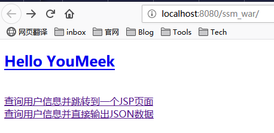

## Spring Boot 学习计划

### 原则
> 先确立几个原则，每天开始学习前大声读三遍！三遍！三遍！
- 莫得完美，做好记录
- 每天结束时根据当天学习的内容调整、补充计划

### 说明
Spring Boot 包含 SSM ？？？
暂时还不能区分出 Spring Boot 和 SSM 的之间的关系，现阶段我比较认同的 Spring Boot 的定义如下
> Spring Boot 是为了让你快速搭建一个 Spring 的项目，把Spring的所有 Project 整合在一起
Spring Boot 解决的是搭建项目快慢的问题，那项目实际是怎么做的就应该不是 Spring Boot 的任务了，因此在此之前还是要学会 Java Web 的常用框架 SSM (对 Servlet + JSP 的模式有一定的了解)

[知乎-spring boot和SSM开发中有什么区别？-陈龙 回答](https://www.zhihu.com/question/284488830/answer/618290880)

### 计划
- 第一阶段：尝个甜头
    - 以能正常运行 [ZHENFENG13/ssm-demo](https://github.com/ZHENFENG13/ssm-demo) 为最终目标了解 SSM 使用到的工具（我觉得该项目并不初学者友好）
    - 多找几个 Demo 熟悉 IDEA 各工具以及技术的使用，暂学习 [IntelliJ-IDEA-Tutorial](https://github.com/judasn/IntelliJ-IDEA-Tutorial) 里的 Demo
- 第二阶段：扎实基础
    - 以 [纯洁的微笑](http://www.ityouknow.com/spring-boot.html) 的 Spring Boot 教程为主线了解 Spring Boot
- 第三阶段：实战演练
    - 将自己的项目 [通讯录](https://github.com/Tindoc/AddressBook) 重构为 SSM 架构，记录其中的问题
    - 根据问题回顾/补充第二阶段的知识

### 进度记录
- 2019.11.11 第二阶段-第 2 日
    - [x] 整理并移动笔记到自己的[仓库](https://github.com/Tindoc/Articles)，便于查看
    - [x] Mybatis 的非 Maven，非 Web 应用学习整理完毕
- 2019.11.05 第二阶段-第 1 日
    - [x] 开始学习 Mybatis 的使用，已经尝试了 XML 配置模式和注解模式，加深了面向对象下数据库映射类的认识
- 2019.10.21 第一阶段-第 6 日
    - [ ] 完成 [IntelliJ-IDEA-Tutorial](https://github.com/judasn/IntelliJ-IDEA-Tutorial) 的 Demo 项目
        - [x] [单模块](https://github.com/judasn/IntelliJ-IDEA-Tutorial/blob/master/maven-java-web-project-introduce.md)成功运行
        
        > 运行步骤：
        >  1. 部署数据库
        >      
        >      该作者的数据库脚本 `doc/db/init.sql` 包括了创建数据库实例和用户以及用户对应密码的 SQL，所以不需要修改 `/src/main/resources/properties/config.properties` 的数据库连接配置（当然改脚本再改配置也行）
        >  2. 修改 MySQL 驱动 jar 包位置（因为作者建议直接下载打包好的 jar 包到指定位置，看 `环境相关/建议你也跟我一样xxxx` ）
        >  
        >      修改项目中 `/src/main/resources/spring/mybatis-generator-config.xml` 中的 `<classPathEntry location="xxxx" />` 值，指向 MySQL 驱动 jar 包位置
        >      > 如果没有修改或在 IDEA Maven 设置中覆盖过 Maven 的本地仓库地址的话，一般是在 `C:\Users\<用户名>\.m2\repository\mysql\<版本>\mysql-connector-java-<版本号>.jar` 里面，该 repository 目录保存的就是 IDEA 管理的所有的 jar 包 
        >      
        >      如果数据库不在本地的还需要修改本文件中的 `<jdbcConnection driverClass="com.mysql.jdbc.Driver" connectionURL="jdbc:mysql://<数据库 IP 地址>/ssm" userId="ssm" password="ssm"/>` （本应使用读取属性的方式来读入会更好）
        - [ ] 多模块成功运行 
    - [ ] 开始第二阶段
- 2019.10.20 第一阶段-第 5 日
    - [x] 使用外部 Tomcat 运行起 Spring Initializr 创建的项目（貌似与外部 Tomcat 的版本有关，9.0 可正常运行，7.0 无效。猜测：内置 Tomcat 版本有关）
    - [x] 完成 [IntelliJ-IDEA-Tutorial](https://github.com/judasn/IntelliJ-IDEA-Tutorial)
- 2019.10.19 第一阶段-第 4 日
    - [x] 了解并实践了 SpringBoot 项目的 [三种创建方式](#SpringBoot相关)
    - [x] 知道了后台接口应用开发工具：PostMan 软件、 Swagger 包、IDEA 自带的 Rest Client（Tools->Http Client->Test RESTful Web Service）

- 2019.10.14 第一阶段-第 3 日（今日总结：一事无成，大项目还是比较难跑起来的，还是走走小 DEMO 吧）
    - [x] 学会 IDEA 一个 window 显示多个项目（原因见 [注意/IDEA 相关](#idea相关)）
        > 勉强实现，不太理想，通过导入多个 module 的方法
    - [ ] 稍微深入了解一下 Github 的多人协作（主要是解决冲突等），实际体验一下
    - [ ] ~~配置项目 [EasyEE](https://github.com/service-java/summer-cli-mybatis/tree/ffa8d5532b73a98de26d29718c5c218450c50f79/__cant-run-now/EasyEE) 环境及运行（尽量流程化一点）~~
    
        真正的项目地址在 [这里](https://github.com/ushelp/EasyEE)，建议使用这个
        > 为什么需要真正的项目地址？
        >
        > 1. 可以直接用 IDEA 的 New->Project from version control->Git 来 **直接** 导入项目
        >       > 实际体验不佳，原因？ GitHub 仓库不一定就是该项目的根目录，可能是多项目的集合。难道是创建项目的姿势不是很对？
        > 2. 原项目是某个学习后端技术的人把 GitHub 上面的某些项目集合在一起的，文件夹层次比较深，不是很方便，而且按理来说文件较大
        （趣事：项目文件夹为 `__cant-run-now` 是不是仓库拥有者还不能跑起来这个项目 :joy: ）
- 2019.10.13 第一阶段-第 2 日
    - [x] 安装 MySql （没有仔细看 ssm-demo 的开发环境介绍，装的是 8.0 的，倒是用 IDEA 的 DB 连接工具执行了脚本，但 demo 就是跑不起来。）
        > 简要分析原因：MuSQL 5.x 和 8.0 有着飞跃的发展，jdbc 的驱动改变了，还有一些配置上的改变。pom.xml 改了依赖，数据库改了时区，建了新用户（root默认不能远程连接），还翻遍了互联网没找到解决的方法，也没能运行起来）
    - [x] 了解到项目的运行/调试是有不同的方式，可以以 JUnit 或者 Tomcat 的方式来运行
    - [x] 运行起 ssm-demo
- 2019.10.12 第一阶段-第 1 日
    - [x] 安装 IDEA （装了旗舰版的，还没激活，试用期用着先）
    - [x] 在 IDEA 中新建 Maven 的 Web-App 项目顺利运行显示"Hello World!"（不求理解跟着步骤走很迷）
    - [x] 修改了 IDEA 的 MAVEN 的 jar 源为阿里云的镜像，加快 build 速度（上个项目 build 了3分钟）
        
        如果出现使用 `mvn install:` 命令失败的话需要回想自己修改源的时候有没有把 `<localRepository>` 的节点删除了，
        如果是的话可以按照 [这里](https://www.cnblogs.com/libingbin/p/5949483.html) 添加回去，只要去掉相关节点注释就可以，作者的 F 盘不一定适合你 
    - [x] 导入了项目 ssm-demo（build 加快了很多；运行失败，没装 MySql）
    - [x] 在 IDEA 设置 Github 账户（重点：File-Settings-Github, VCS）
    - [x] 使用 Github 组织成员的工作流程（以前只用过个人的工作流程）