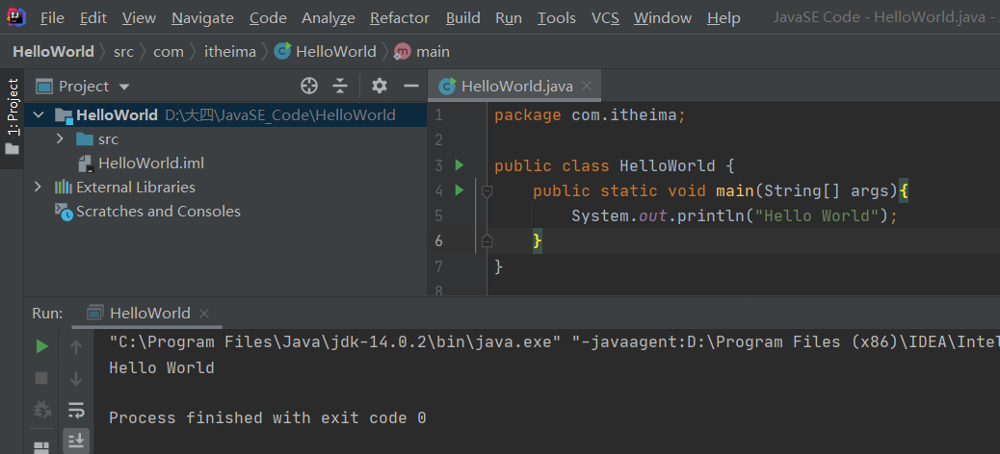
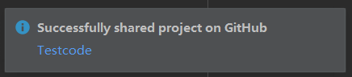
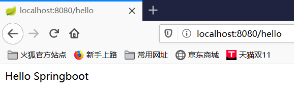
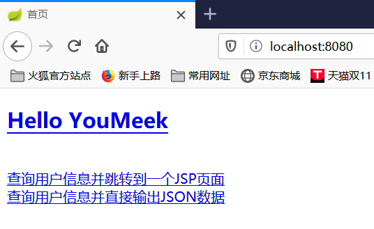
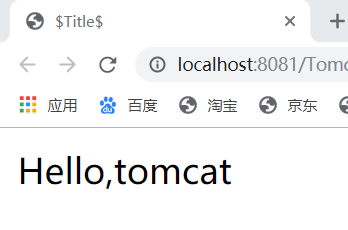
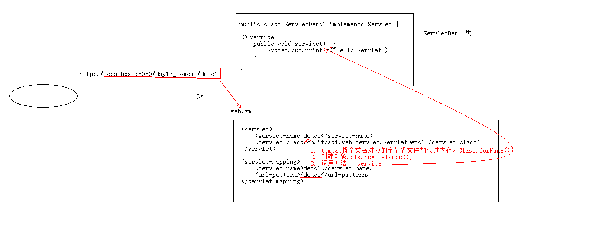

# 学习计划

## 一、Spring-boot

### 第一阶段

- 环境准备：Java开发环境，Spring-boot开发环境，MySQL环境
- 自己创建项目并成功运行
- 多跑几个项目，总结步骤

### 第二阶段

- 熟悉IDEA的使用

- 了解项目目录结构和配置
- 学习Maven 多模块项目，Maven打包

### 第三阶段

待更新

## 进度

- 2020/10/20
  - [x] 了解 Github 的多人协作
    - 分支的操作
    - 解决冲突
  
  - [x] 创建一个简单的demo并熟悉项目结构
  
    创建空目录 -> 创建新模块 -> 在模块下的src下创建一个package包 -> 在package包下新建一个类 -> 在类中编写代码 -> 代码区Ctrl+Shift+F10运行
    
    
  
  - src：自己写的源码
  - out：编译后的文件(比如.class)
  - External Libraries：依赖的jar包
  
  - [x] IDEA中的快捷键
  
    - 内容辅助键
  
      | 作用               | 快捷键         |
      | ------------------ | -------------- |
      | 快速生成main()方法 | psvm+enter     |
      | 快速生成输出语句   | sout+enter     |
      | 内容提示，代码补全 | Ctrl+Alt+space |
  
    - 快捷键
  
      | 作用     | 快捷键       |
      | -------- | ------------ |
      | 单行注释 | CTRL+/       |
      | 多行注释 | CTRL+SHIFT+/ |
      | 格式化   | CTRL+ALT+L   |
  
  - [x] IDEA中的模块操作
  
    - 新建模块
  
      File -> New -> Module -> 选择JDK路径 Next -> 修改Content root
  
    - 删除模块
  
      - 在项目结构区移除模块
  
        选择模块 -> Remove Module
  
      - 在文件目录中彻底删除模块
  
        在项目文件夹下找到对应模块并删除
  
    - 导入模块
  
      File -> New -> Module from Existing Sources -> 选择模块名
  
  - [x] 配置环境
  
    - [x] Java环境
  
    - [x] IDEA安装
  
    - [x] 上传一个项目到GitHub(真的太方便了吧)
  
      
  
    - [x] Maven镜像配置
  
- 2020/10/21

  - [x] 配置MySQL环境+安装Navicat

    - [x] 在IDEA上配置好环境

  - [x] 安装Tomcat并在IDEA上配置好

  - [ ] 熟悉IDEA使用git插件
  
    - [x] [多人协作场景](https://blog.csdn.net/Y125348369/article/details/87907729)
  
  - [x] 确认springboot环境配置完毕
  
  - [x] 创建一个HelloSpringboot项目
  
    
  
    - 常见报错
      - 提示：'settings.xml' has syntax errors -> settings-maven-修改Usersettingsfile为正确的settings.xml路径
      - 提示“不支持发行版本 5（或其他版本）” -> 统一这几个地方的 Java版本 
        -  File -> Project Structure
        -  File -> settings-> Build,Execution,Deployment -> Compiler -> Java Compiler
        -  File -> project Structure -> Modules
  
  - [x] SSM入门
  
    >  无论学习什么技术，学习之前都要知道这项技术是什么，为什么要学，学习有什么好处
  
    > - SSM：Spring+SpringMVC+Mybatis 
    >
    >   > - Mybatis：数据访问层框架，进行Java连接数据库
    >   >
    >   >   > - ORM框架(Object_Relative DataBase_Mapping)
    >   >   >   - 在Java对象和关系数据库之间建立某种映射，实现直接存取java对象
    >   >   >   - 都是在JDBC上封装了一层
    >   >   >
    >   >   > - JDBC：执行SQL语言的Java API
    >   >
    >   > - SpringMVC：基于mvc的web框架
    >   >
    >   > - Spring：管理对象周期
    >   >
    >   >   > - 核心：
    >   >   >   - IOC：解决对象管理和对象依赖问题
    >   >   >     - 实现：把对象交给IOC容器管理(不太能理解，感觉有点像vue的store，但又比store强大)
    >   >   >   - AOP：解决非业务代码抽取的问题
    >   >   >
    >   >   > - 日后需要理解的概念：
    >   >   >   - [ ] 工厂模式 -> IOC -> 依赖注入\ 控制反转 
    >   >   >   - [ ] 代理模式 -> AOP

- 2020/10/22

  - 熟悉IDEA的使用

    - [x] 了解安装目录和设置目录
      - 修改idea.exe.vmoptions
      - 把 IntelliJ IDEA配置改坏时可以删除设置目录文件

    - [x] 设置常见视图、查看ProjectStructure和设置常用的settings
    - [x] 关联数据库、导入初始化数据库文件
      - 连接数据库的URL后要添加“ ?serverTimezone=GMT%2B8 ”
      - 修改数据库配置

    - [x] 版本控制之git

  - [x] 跑起来一个[Maven的单模块SSM项目](https://github.com/judasn/IntelliJ-IDEA-TutorialMaven)

  

- 不求甚解，道阻且长，确定下阶段的系统学习方向和小目标(整合一个SSM项目)

- 2020/10/23

  - 补充学习昨天跑项目疑惑的Javaweb基础

    - [x] xml

      - 复习xml概念、语法、组成部分
      - 学会在xml中引入约束文档(DTD和Schema)
      - 简单的读懂约束文档

    - [x] Tomcat

      - [x] 目录结构

        - bin：可执行文件
          - startup.bat/startup.sh(linux操作系统下)
          - shutdown.bat

        - conf：配置文件
          - conf/server.xml下Connector节点可修改端口号

        - log：日志文件，启动报错时可查看”Caused by:“

        - webapps：存放web项目(相当于部署项目在web服务器下的root文件)

        - work：存放运行时的数据(学完jsp再来理解一下)

      - [x] 启动并访问、关闭

        - 启动后不要关闭黑窗
        - 启动报错”Address already  in use“的解决
        - 尽量不要点击”ד强制关闭

      - [x] 配置

        - 部署项目的三种方式
        - java动态项目的目录结构

      - [x] 能看懂IDEA集成的tomcat设置了

        (IDEA真的太强大了以至于小白使用 日常有种不塌实的迷茫感)

        - 设置[on Update action](https://blog.csdn.net/xlb744868186/article/details/81017864) 
        - Deployment -> Application context ：虚拟目录设置("/"表示根目录)

      - [x] 创建一个web项目

        

        - IDEA2020.2在创建完项目后要Add Framework support添加Web Application并确认create web.xml（如果没有Framwork就在setting里安装插件）

        - 回想昨天导入的项目：

          - 导入的项目如果有以下，表示已经配置好tomacat

          

          - 没有显示或者新建项目需要在Edit Configuration添加

    - [x] Servlet：sever applet

      - Servlet就是一个接口，定义了Java类被浏览器访问到(tomcat识别)的规则

      - servlet在web.xml中的配置

      - 执行原理

        

      - 生命周期方法

- 2020/10/24
  - [ ] 跑一个Springboot项目

