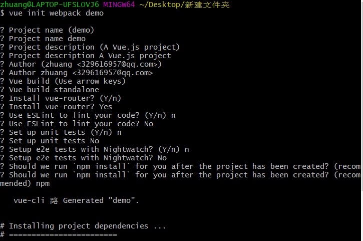
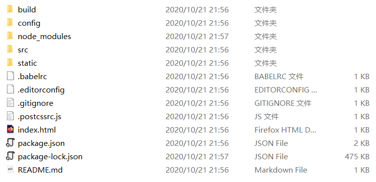
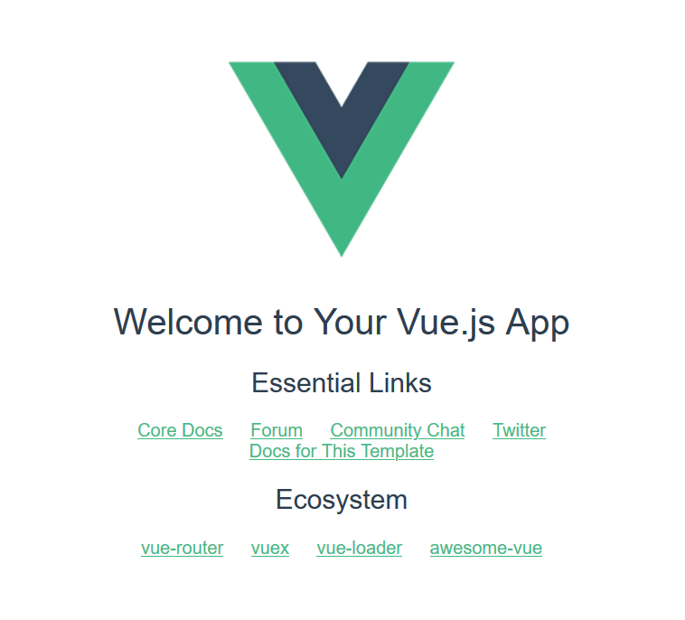

# Learning-Plan

###### 记录每日学习内容 (updated by 10.22)  ------ [CSDN笔记](https://blog.csdn.net/zhuangww05)

| 任务 |                 内容                  |
| :--: | :-----------------------------------: |
|  1   | 用Vue-Cli搭建项目并了解每个文件的作用 |
|  2   |   运行一个开源项目并理清思路和代码    |
|  3   |            学习Webpack配置            |
|  4   |        自己创建一个项目并运行         |

#### 2020.10.20

- 学习Markdown

  >自己有在CSDN做学习笔记的习惯，其中有内置Markdown的文本编辑器，今天正式学习起来会比较得心应手

- 学习Git的基本使用

  > 大二下学期曾经学习过Git，因为经常不用，所以也忘了。不过再次学习起来会以比较快的速度

#### 2020.10.21

- 用Vue-Cli搭建了项目并查阅了资料了解每个项目文件的基本作用

  >前提：安装webpack / webpack-cli / vue-cli
  >
  >
  >
  >进行初步配置之后便自动化搭建项目环境（[每个文件的详细解释](https://www.cnblogs.com/jacksplwxy/p/11495700.html)）
  >
  >
  >
  >在终端运行 npm run dev 便可以初始化项目
  >
  >

- 成功运行了Xboot-font项目

  >1.项目文件都是常规的脚手架自动化搭建的构造
  >
  >2.目前在学习的点就是Vue组件的分配，本人在自己做网站项目的时候对于此组件化的思想理解的并不是很透彻，不清楚如何规划一个页面的单独组件和多个页面组件的共同组件，希望可以通过分析此开源项目可以理解这一点，在理清楚代码之后会记录下来

- 在学习Spring-Boot之前复习了JavaSE基础

  >1.老生常谈的各种编程语言的基本数据类型、引用类型、常量、逻辑语句、数组、异常、继承、重写重载、抽象方法、封装方法、集合框架、泛型还有不是熟悉的多线程

#### 2020.10.22

- 分析Xboot-font前端页面源码

- 入门Spring-Boot框架

  > 1.安装IDEA
  >
  > 2.添加Spring Assistant插件
  >
  > 3.搭建Spring-Boot项目
  >
  > 4.学习yaml并配置application.yaml
  >
  > 5.学习@Value和ConfigurationProperities()为对象属性赋值
  >
  > 6.创建index.html并运行main()，通过本地地址访问页面
  >
  > 7.学习thymeleaf模板引擎

#### 2020.10.23

- 复习Vue

  >1.组件间通信
  >
  >2.插槽
  >
  >3.生命周期
  >
  >4.vue-router
  >
  >5.vuex

- Javascript高级程序设计 - 客户端检测章节

  >1.能力检测，识别浏览器的能力
  >
  >2.怪癖检测，知道浏览器存在什么缺陷
  >
  >3.用户代理检测，确认用户实际使用的浏览器

- 分析Xboot-font前端页面源码