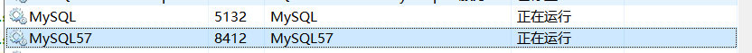
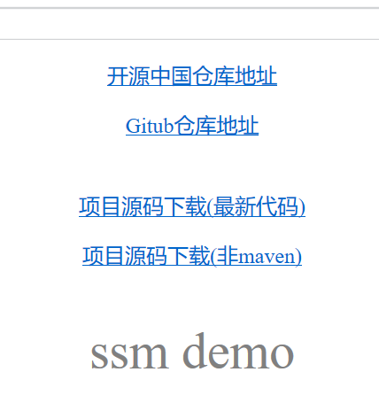
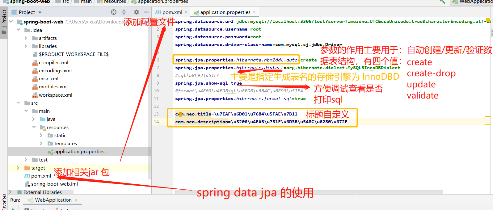
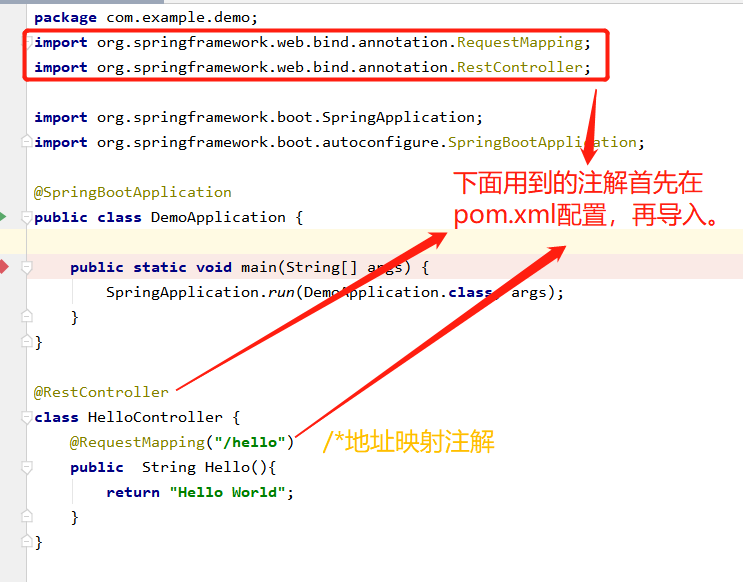
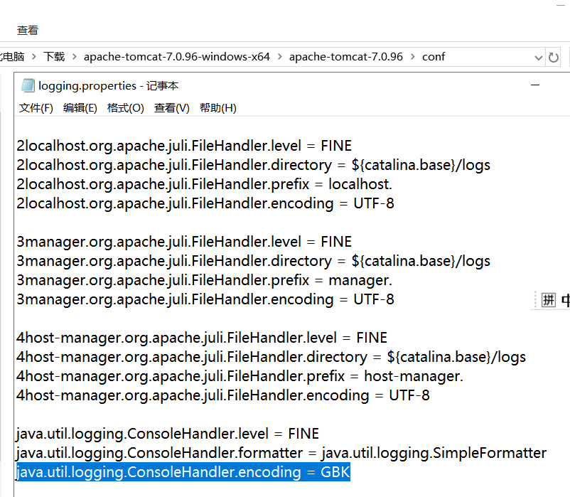
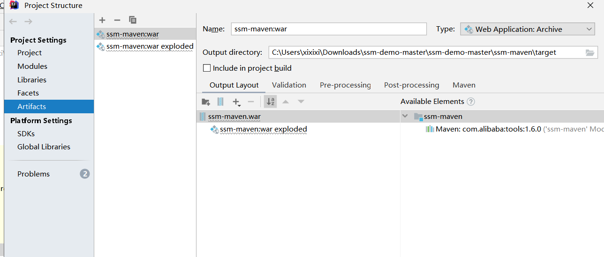
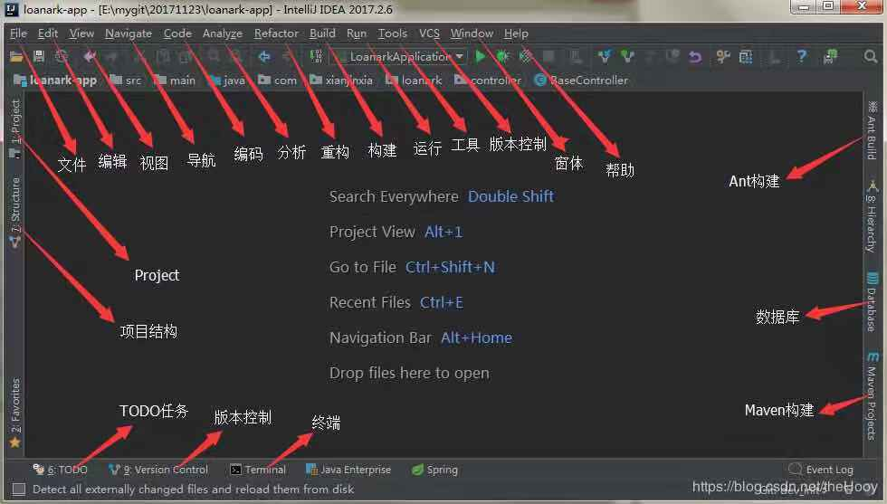

# Spring-boot学习计划

### 每日更新，任重道远。
###### 最新进度（update ）

## 10月学习计划
### 1.spring-boot
| 阶段 | 项目计划 |
| :------: | :------: |
|1|正常运行一个sping-boot开源demo|
|2|结合教程细致分析代码及框架|
|3|自己创建一个项目并运行|
|4|总结分析与强化|

##### 进度跟踪1.1

> 1.做计划的时候了解了spring-boot相关的知识结构体系，如mvc，mybatics，ssm，jackson等，暂时哈没有弄懂，计划在实际项目操作中重点熟悉相关知识点。  
> 2.导入一个开源项目的demo，看的有点迷茫。（10.13）  
> 3.开始导入师兄分享的demo，尝试运行它。（10.14）
> 运行成功<https://github.com/ZHENFENG13/ssm-demo>的ssm_maven项目（10.18）  
 
>- 注意事项：重启后一定记得打开MySQL服务  
>- [ ] 尝试运行ssm_demo_master的demo模块，没有成功。（10.20）  
##### 进度跟踪2.1（以 [纯洁的微笑](http://www.ityouknow.com/spring-boot.html) 的 Spring Boot 教程为主线了解 Spring Boot）
> 2.1.1 Spring Boot(一)：入门篇  #笔记（10.23）  
 
> 2.1.2 Spring Boot(二)：Web 综合开发 #笔记1   
 >  jpa数据操作：利用 Hibernate 生成各种自动化的 sql  
 >  步骤：  
 >> 1.在pom.xml中添加相关jar文件  
 >> 2.在resource的application.properties添加配置文件 如图：  
 >>   
 >> 其中：create： 每次加载 hibernate 时都会删除上一次的生成的表，然后根据你的 model 类再重新来生成新表，哪怕两次没有任何改变也要这样执行，这就是导致数据库表数据丢失的一个重要原因。
       create-drop ：每次加载 hibernate 时根据 model 类生成表，但是 sessionFactory 一关闭,表就自动删除。
       update：最常用的属性，第一次加载 hibernate 时根据 model 类会自动建立起表的结构（前提是先建立好数据库），以后加载 hibernate 时根据 model 类自动更新表结构，即使表结构改变了但表中的行仍然存在不会删除以前的行。要注意的是当部署到服务器后，表结构是不会被马上建立起来的，是要等 应用第一次运行起来后才会。
       validate ：每次加载 hibernate 时，验证创建数据库表结构，只会和数据库中的表进行比较，不会创建新表，但是会插入新值。  
 >> 3.添加实体类和 Dao （dao 只要继承 JpaRepository 类就可以，不用写方法。可以根据方法名来自动的生成 SQL，比如findByUserName 会自动生成一个以 userName 为参数的查询方法，比如 findAlll 自动会查询表里面的所有数据，比如自动分页等等。）  
 >> 4.测试（未成功，解决ing)
##### 进度跟踪3.1
> 1.创建并运行一个spring-boot的“hello world”简单项目（10.19）  
  
> - 源代码如下  
  
>- 收获：1.复习了java SE的注解；2.了解了idea新建项目的操作，事实上idea基本是全自动的，一直next到所有文件夹都生成好给你，这与eclipse有较大的区别，我们只需要在已有的结构上添加即可；3.进一步了解了spring-boot的结构，例如发现maven整合了jar包；4.结合昨天运行的demo界面，有一点点灵感可以通过不断添加开发模块将helloworld转变成为多功能的界面。

### 2.Idea软件的使用
| 阶段 | 项目计划 |
| :------: | :------: |
|1|配置idea环境|
|2|熟悉各种插件|
|3|掌握使用idea开发一个项目的相关用法|
##### 进度跟踪2.1
> 2.1.1下载Idea软件，根据网上的教程配置Idea（较为简单，通过jar文件即可）（10.11）  
> 2.1.2 配置mysql环境，配置spring-boot环境。（10.14）  
> 2.1.3 maven本地配置，加快maven加载速度。（10.15）  
>> &#9733;配置方法:copy网上分享的settings.xml文件到本机的.m2文件夹中  
>
> 2.1.4 安装tomcat并配置到idea（10.16）  
>> &#9733;配置步骤：idea界面 run>edit configuration>+>more items>tomcat server>自动识别（识别不成功尝试手动配置）  
>
>> &#9733;&#9733;注意事项：
> 1.安装完成后需配置环境变量CATALINA_BASE,CATALINA_HOME及Path。  
> 2.启动时tomcat乱码需修改一下conf/logging.ptoperties的一个语句。

> 2.1.5 Tomcar详细部署的记录(10.21)
> - [x] 配置tomcat的详细部署Artifacts，tomcat的Deployment没有Artifacts的时候是不能run的，这时我们可以从错误提示中打开Artifacts的设置或者是file-projocet struccture-Aritifacts，然后创建一个输出依赖。（10.21）  
   
 > - [x] 对maven项目的运行过程更了解了，双击使用右侧的maven的package生成一个项目的war包，然后Artifacts的Output Layout加上war包后，tomcat上面的Deployment就可以用了。
   
##### 进度跟踪2.2
> 2.2.1了解markdown插件并学习了markdown语法。(10.12)  
> 2.2.2了解git插件，并掌握从idea上传文件到github上面的方法。（10.13）  
> 2.2.3 Idea的全局搜索失灵，解决办法：解决其他快捷键冲突！（10.23）
##### 进度跟踪2.3
> 2.3.1通过导入项目摸索中（10.14）  
> 2.3.2 了解idea的界面  (10.17)
> 
> 2.3.3 
##### spring-boot运行方法（10.22）
| 方法 | 步骤 |
| :------: | :------: |
|1|直接执行起mian方法（课堂上最常用到的方式）|
|2|用Maven/Gradle插件运行（Maven用到过)|
|3|打成jar包，通过java-jar命令直接执行|

### 3.Java EE系统知识的学习

- [x] 红色模块 学校课程Java SE基本掌握
- [x] 紫色模块 依据网上的教程及老师的讲解基本掌握
- [ ] 绿色模块 当前任务，但需完成绿色模块还需结合前面未掌握的蓝色模块及黄色模块。计划跟着项目走，画五角星的各个顶点。
###### 进度跟踪
> 接触了基础的java切面编程并实现（10.18）