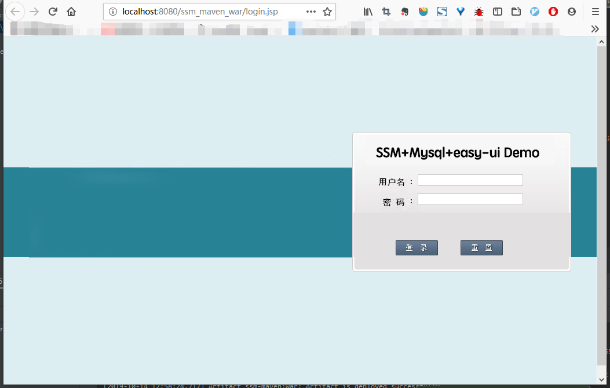
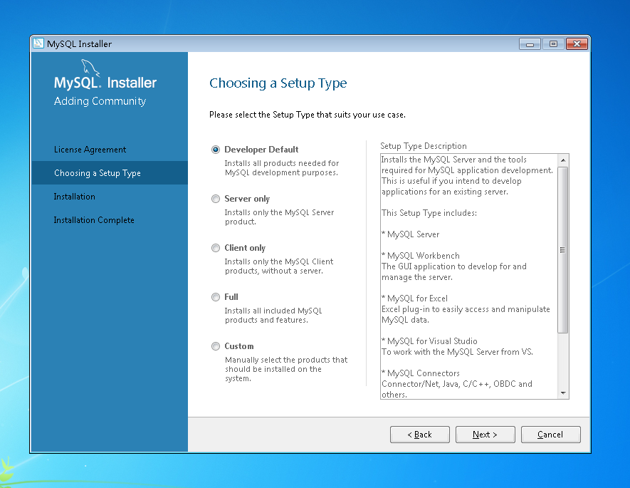
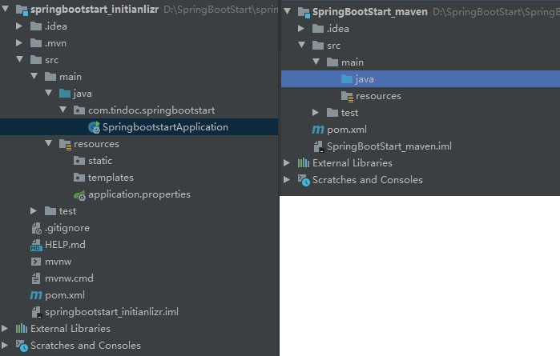

## Spring Boot 学习计划

### 原则
> 先确立几个原则，每天开始学习前大声读三遍！三遍！三遍！
- 莫得完美，~~完成第一~~ 做好记录
- 每天结束时根据当天学习的内容调整、补充计划

### 说明
Spring Boot 包含 SSM ？？？
暂时还不能区分出 Spring Boot 和 SSM 的之间的关系，现阶段我比较认同的 Spring Boot 的定义如下
> Spring Boot 是为了让你快速搭建一个 Spring 的项目，把Spring的所有 Project 整合在一起
Spring Boot 解决的是搭建项目快慢的问题，那项目实际是怎么做的就应该不是 Spring Boot 的任务了，因此在此之前还是要学会 Java Web 的常用框架 SSM (对 Servlet + JSP 的模式有一定的了解)

[知乎-spring boot和SSM开发中有什么区别？-陈龙 回答](https://www.zhihu.com/question/284488830/answer/618290880)

### 计划
- 第一阶段：尝个甜头
    - 以能正常运行 [ZHENFENG13/ssm-demo](https://github.com/ZHENFENG13/ssm-demo) 为最终目标了解 SSM 使用到的工具（IDEA, Maven, MyBatis 等）
    - ~~跟随项目作者的教程走一篇，从0开始搭建，代码可复制/粘贴。注重开发的流程以及工具的深入了解。~~（我觉得该项目并不初学者友好）
    - 多找几个 Demo 熟悉 IDEA 各工具以及技术的使用，暂学习 [IntelliJ-IDEA-Tutorial](https://github.com/judasn/IntelliJ-IDEA-Tutorial) 里的 Demo
- 第二阶段：扎实基础
    - 以 [纯洁的微笑](http://www.ityouknow.com/spring-boot.html) 的 Spring Boot 教程为主线了解 Spring Boot
- 第三阶段：实战演练
    - 将自己的项目 [通讯录](https://github.com/Tindoc/AddressBook) 重构为 SSM 架构，记录其中的问题
    - 根据问题回顾/补充第二阶段的知识

### 进度记录
- 2019.10.20 第一阶段-第 5 日
    - [ ] 使用外部 Tomcat 运行起使用 Spring Initializr 创建的项目
    - [ ] 完成 [IntelliJ-IDEA-Tutorial](https://github.com/judasn/IntelliJ-IDEA-Tutorial)
- 2019.10.19 第一阶段-第 4 日
    - [x] 了解并实践了 SpringBoot 项目的 [三种创建方式](#SpringBoot相关)
    - [x] 知道了开发后台：PostMan 软件和 Swagger 包

- 2019.10.14 第一阶段-第 3 日（今日总结：一事无成，大项目还是比较难跑起来的，还是走走小 DEMO 吧）
    - [x] 学会 IDEA 一个 window 显示多个项目（原因见 [注意/IDEA 相关](#idea相关)）
        > 勉强实现，不太理想，通过导入多个 module 的方法
    - [ ] 稍微深入了解一下 Github 的多人协作（主要是解决冲突等），实际体验一下
    - [ ] ~~配置项目 [EasyEE](https://github.com/service-java/summer-cli-mybatis/tree/ffa8d5532b73a98de26d29718c5c218450c50f79/__cant-run-now/EasyEE) 环境及运行（尽量流程化一点）~~
    
        真正的项目地址在 [这里](https://github.com/ushelp/EasyEE)，建议使用这个
        > 为什么需要真正的项目地址？
        >
        > 1. 可以直接用 IDEA 的 New->Project from version control->Git 来 **直接** 导入项目
        >       > 实际体验不佳，原因？ GitHub 仓库不一定就是该项目的根目录，可能是多项目的集合。难道是创建项目的姿势不是很对？
        > 2. 原项目是某个学习后端技术的人把 GitHub 上面的某些项目集合在一起的，文件夹层次比较深，不是很方便，而且按理来说文件较大
        （趣事：项目文件夹为 `__cant-run-now` 是不是仓库拥有者还不能跑起来这个项目 :joy: ）
- 2019.10.13 第一阶段-第 2 日
    - [x] 安装 MySql （没有仔细看 ssm-demo 的开发环境介绍，装的是 8.0 的，倒是用 IDEA 的 DB 连接工具执行了脚本，但 demo 就是跑不起来。）
        > 简要分析原因：MuSQL 5.x 和 8.0 有着飞跃的发展，jdbc 的驱动改变了，还有一些配置上的改变。pom.xml 改了依赖，数据库改了时区，建了新用户（root默认不能远程连接），还翻遍了互联网没找到解决的方法，也没能运行起来）
    - [x] 了解到项目的运行/调试是有不同的方式，可以以 JUnit 或者 Tomcat 的方式来运行
    - [x] 运行起 ssm-demo（忧愁）
        
- 2019.10.12 第一阶段-第 1 日
    - [x] 安装 IDEA （装了旗舰版的，还没激活，试用期用着先）
    - [x] 在 IDEA 中新建 Maven 的 Web-App 项目顺利运行显示"Hello World!"（不求理解跟着步骤走很迷）
    - [x] 修改了 IDEA 的 MAVEN 的 jar 源为阿里云的镜像，加快 build 速度（上个项目 build 了3分钟）
        
        如果出现使用 `mvn install:` 命令失败的话需要回想自己修改源的时候有没有把 `<localRepository>` 的节点删除了，
        如果是的话可以按照 [这里](https://www.cnblogs.com/libingbin/p/5949483.html) 添加回去，只要去掉相关节点注释就可以，作者的 F 盘不一定适合你 
    - [x] 导入了项目 ssm-demo（build 加快了很多；运行失败，没装 MySql）
    - [x] 在 IDEA 设置 Github 账户（重点：File-Settings-Github, VCS）
    - [x] 使用 Github 组织成员的工作流程（以前只用过个人的工作流程）

### 注意
##### MySQL 的安装
1. 到 [官网](https://dev.mysql.com/downloads/) 下载社区版
    > 虽然 MySQL 是开源的，但也提供企业版。下载时默认版本是 8.0 ，下载界面右侧可选其他版本
2. 安装时只需选择安装 'Server only' 即可，因为可以通过 IDEA 来管理，不需要像以前装 sqldevelper(Oracle), SSMS(SQL Server) 这些 GUI 的管理工具
    
3. 安装时请创建一个用户，默认 root 用户是不能远程连接的，但是可以修改，关键词是 “开启远程访问”、“host” 等
    > 如果用不到远程连接可以不用新建，但是正常的项目为了安全不应该使用 root 账户。
    我的习惯：创建一个名为 dev 的账户
4. 如果在 IDEA 中测试连接数据库提示 serverTimeZone 类似错误，可以按照错误提示设置时区为 `GMT-8` (东八区)
    > 这只是途径之一，还可以 [这样](https://blog.csdn.net/cy12306/article/details/97259049) 修改, 但其实一步也能解决问题。
    原因大概在数据库默认安装的时候使用的是时区是 SYSTEM (从链接中可以看出)，而这个值是美国时区，出现了不匹配或 IDEA 不清楚 SYSTEM 的定义
5. IDEA 的 Database 操作可以看 [这里](https://github.com/judasn/IntelliJ-IDEA-Tutorial/blob/master/database-introduce.md)
    > 十分推荐上面这个 IDEA 的教程 
6. 卸载旧版本/重装新版本 [这个](https://zhuanlan.zhihu.com/p/68190605) 
    > 按照里面有的就操作，没有的就不管（我是成功了，但不一定都可以 :no_mouth: ）

#### IDEA相关
主要参考：
> [1](https://github.com/judasn/IntelliJ-IDEA-Tutorial)
>
> [2](https://www.cnblogs.com/jajian/category/1280011.html)
1. 单 IDEA 窗口需要显示多个项目的原因（仅个人认为，暂时没找到很好的办法解决）
    - 多个 Project 之间不共享数据库连接这些，每个项目都配置一次麻烦
    - 每次切换多个 IDEA 窗口比较麻烦，单窗口的话可以在标签之间切换
2. IDEA 安装插件的实际意义就是安装对应的软件，以 Maven 举例

    由于旗舰版的 IDEA 安装时默认勾选了 Maven，所以在安装的时候就已经把 Maven 装上了，
    想要在 Windows 的终端中执行 mvn 命令的话只需要设置 PATH 即可，无需手动安装 Maven，
    一般来说，IDEA 的 Maven 安装在 `C:/Program Files/JetBrains/IntelliJ IDEA 2019.2.3/plugins/` 文件夹内
    （取决于安装时的选项，还可以在 IDEA 的 `Settings->Build, Execution, Deployment->Maven->Maven home directory` 中查看到具体的目录），
    只需要在该文件夹里找到 Maven 的 `/bin` 目录，添加到系统变量之后重启电脑使之生效即可（可以注意到这里装了 maven2 和 maven3 两个版本）
3. 如果不想在打开 IDEA 的时候就自动打开最近的项目，可以按如下设置
    
    取消勾选 `File->Settings->System Settings->Startup/Shutdowm` 里面的项目
    
    设置后打开 IDEA 时会让你选择需要打开的项目
4. IDEA 的两个重要目录
    - 安装目录中 `C:\Program Files\JetBrains\IntelliJ IDEA <版本>\bin` 有两个重要的文件
        - `idea<64/无>.exe.vmoptions` : 可执行文件的 VM 配置文件（大概是配置 VM 怎么执行可执行文件，即设置执行时的一些参数）
        - `idea.properties` : IDEA 的属性配置文件
        > 建议使用 Help->Edit Custom VM Options 和 Help->Edit Custom Properties 来修改，具体修改参考 [这里](https://github.com/judasn/IntelliJ-IDEA-Tutorial/blob/master/installation-directory-introduce.md)
    - **用户设置** 一般在当前用户的 Home 目录（Winodws 为 `%userprofile%`，Mac/Linux 为 `~`）的 `.IntelliJIdea<版本>` 文件夹，如果配置到不可理解的阶段，可以删除掉整个文件夹，IDEA 会重新创建一个，恢复到默认状态
        - `config` : IDEA 个性化化配置目录，或者说是整个 IDE 设置目录。主要记录了：IDE 主要配置功能、自定义的代码模板、自定义的文件模板、自定义的快捷键、Project 的 tasks 记录等等个性化的设置（安装不同版本时可导入这些设置）
        - `system` : IDEA 系统文件目录，里面主要有：缓存、索引、容器文件输出等等
5. 修改编码
    File->Settings->Editor->File Encodings 建议全部设置为 UTF-8 。另，勾选 Properties Files->Transparent native-to-ascii conversion 把 properties 文件的中文显示出来
6. 
    
#### SpringBoot相关
1. 三种创建方式
    1. 在 IDEA 中创建一个 Spring Initializr 项目（必须联网）
        
        > 实际上就是第三种方法的一种便捷方式，在创建项目时可看到 `Choose Initializr Service URL` 指向的就是 [start.spring.io](https://start.spring.io/)
        
        其中，在 `项目/src/main/java/包名/xxxxApplication` 中由 `@SpringBootApplication` 注释指明了本 Web 项目的启动类，并在 `main` 函数中调用 `SpringApplication.run()` 启动项目
        
        一个控制器类的例子
        ```java
        package com.tindoc.springbootstart;
        
        import org.springframework.web.bind.annotation.GetMapping;
        import org.springframework.web.bind.annotation.RestController;
        
        @RestController // 处理http请求；等同于 @Controller + @ResponseBody
        public class HelloWorld {
            @GetMapping ("/hello") // 映射 /hello 的 get 方法
            public String hello() {
                return "Hello, SpringBootStart_initializr.";
            }
        }
       ```
        
        > 小问题，使用这种模式下创建的项目的 artifactId 不允许含有大写字母，原因不详
             
    2. 在 IDEA 中创建一个 Maven 项目，手动加入 Spring 的依赖
        
        创建完项目之后的区别如下图：（左边为创建完 Spring Initializr 项目的项目结构，右边为 Maven 项目的项目结构）
        
        
        
        可以看出差异还是很大的，比较重要的是
        - 缺少启动类 xxxxApplication.java
        - resources 文件夹缺少 application.properties 配置文件
        - 在 External Libraries 中只有 java 1.8 的 jar 包
        - pom.xml 中缺少了很多配置
        
        **那如何使一个 Maven 项目变成一个 SpringBoot 项目？**
        1. 在文件 pom.xml 中添加 SpringBoot 的引用，至少需要以下三个
            ```xml
           <!-- 添加 java 版本属性 -->
           <properties>
               <java.version>1.8</java.version>
           </properties>
           
           <!-- 添加 SpringBoot 的父项目 -->
           <parent>
               <groupId>org.springframework.boot</groupId>
               <artifactId>spring-boot-starter-parent</artifactId>
               <version>2.2.0.RELEASE</version>
           </parent>
       
           <!-- 手动添加依赖 -->
           <dependencies>
               <dependency>
                   <groupId>org.springframework.boot</groupId>
                   <artifactId>spring-boot-starter-web</artifactId>
               </dependency>
           </dependencies>
       
           <!-- 手动添加 Spring Boot Maven 插件，用于将应用打包为一个可执行的 jar 包 -->
               <!-- 可以使用 Maven->LifeCycle->package 来打包为 jar/war 文件 -->
           <build>
               <plugins>
                   <plugin>
                       <groupId>org.springframework.boot</groupId>
                       <artifactId>spring-boot-maven-plugin</artifactId>
                   </plugin>
               </plugins>
           </build>
            ```
           编写完 pom.xml 之后 IDEA 就会引入指明的 jar 包到 External Libraries 中
        2. 添加启动器类
            ```java
           package appStart;
           
           import org.springframework.boot.SpringApplication;
           import org.springframework.boot.autoconfigure.SpringBootApplication;
           
           @SpringBootApplication // 指明启动类
           public class Start {
               public static void main(String[] args) {
                   SpringApplication.run(Start.class, args);   // 说明运行哪一个类
               }
           }
            ```
        
    3. 在 [start.spring.io](https://start.spring.io/) 中下载模板，再在 IDEA 中导入该项目
        
        与第一种方式基本一致，要注意：
        
        如果在导入的最后一步指定了其他的项目文件夹的话，IDEA 不会自动将导入的项目复制到新的文件夹，而是链接了起来，**所以不能删除原导入项目，最好的做法就是不要修改文件夹**
            
        > 可以理解为，最后一步并不能将文件移动到一个新的文件夹，只是复制了一份 .idea 这个文件夹到新的文件夹 
2. 如果使用 Maven 打包为 jar 包，再使用 `java -jar xxx.jar` 运行时，需要注意可能不能正常关闭项目
    windows 使用 `netstat -aon|findstr "8080` 来查看监听端口号为8080的进程，就可以使用 `tskill` 来强制关闭进程或使用任务管理器关闭
3. 启动方式
    1. 如果使用 Spring Initializr 创建的项目默认使用 Spring Boot 内置的 Tomcat 来运行，不需要设置 Tomcat
    2. 如果想使用非 Spring Boot 内置的 Tomcat 来运行的话，需要完成以下步骤  **暂未实现**
        [参考](https://blog.csdn.net/fanshukui/article/details/80258793)
    
#### Tomcat 相关
1. Tomcat 启动乱码
    修改 `Tomcat安装目录/conf/logging.properties` 下的  `java.util.logging.ConsoleHandler.encoding = utf-8` 改为 GBK 即可